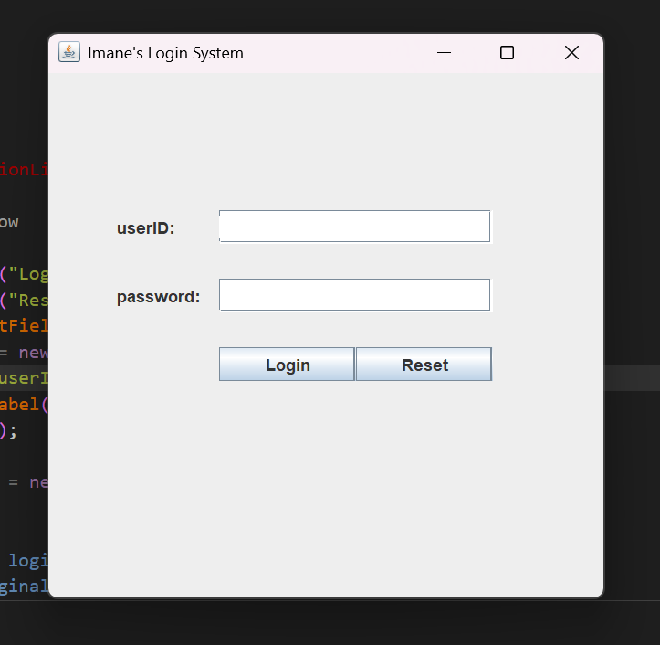

# Simple Login System (Java Swing) 🚀

A clean and functional Java GUI application built using **Swing**. This project demonstrates the core principles of Object-Oriented Programming (OOP) and Event Handling in Java.

> [!IMPORTANT]
> **Project Speedrun:** This entire project was conceptualized, designed, and built in **just one day!**

## 🛠 Features
- **Local Authentication:** Uses a secure `HashMap` structure for user validation.
- **Dynamic GUI:** Custom-built interface with Frames, Labels, and TextFields.
- **Security:** Integrated `JPasswordField` to mask sensitive input.
- **Reset Functionality:** Quick-clear feature for user convenience.

## 🏛 Architecture
1. **Main.java:** The entry point that launches the application.
2. **IdAndPasswords.java:** The data layer (currently using local storage).
3. **LoginPage.java:** The main UI logic and event handling.
4. **WelcomePage.java:** The dashboard shown upon successful login.  
   ---
   
---
## 🚀 How to Run
1. Clone the repository.
2. Open the project in VS Code or any Java IDE.
3. Run `Main.java`.
4. Use the default credentials found in `IdAndPasswords.java` (e.g., imane/dev2026).

## 👩‍💻 Developer
**Imane** - Software Development Student
*Focused on creating efficient and user-friendly applications.*

## 📝 Future Plans
- [ ] Implement a **Database** (MySQL/PostgreSQL) for persistent user storage.
- [ ] Add **Password Hashing** (bcrypt) for enhanced security.
- [ ] Create an **Admin Panel** for user management.
- [ ] Add **Email Verification** for new user registration.
